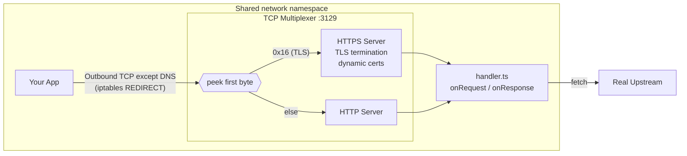

# wormhole

A transparent HTTP/HTTPS proxy sandbox for Docker. Drop it next to any container and intercept, inspect, or mutate every outbound request — no code changes required in your app.

Write a TypeScript handler file, mount it into the proxy, and every request your app makes passes through your `onRequest` / `onResponse` hooks before hitting the real upstream. All other outbound traffic is blocked.

## How It Works



1. Your app container shares the proxy's network namespace (`network_mode: "service:proxy"`)
2. An iptables rule redirects outbound TCP traffic to port `:3129`, while letting DNS through and exempting traffic from UID 1337 (the proxy itself)
3. A TCP multiplexer peeks at the first byte of each connection: `0x16` (TLS) routes to the HTTPS server, anything else routes to the HTTP server
4. For HTTPS, the proxy terminates TLS with a dynamically generated certificate for each domain, signed by a local CA
5. Your `handler.ts` hooks inspect and mutate the request before it's forwarded upstream
6. The proxy fetches the real upstream, passes the response through your `onResponse` hook
7. Your app gets back a response as if it talked to the upstream directly
8. All non-HTTP/HTTPS outbound traffic is blocked (sandbox mode)

## Quick Start

### 1. Create `docker-compose.yml`

```yaml
services:
  proxy:
    build: .
    cap_add:
      - NET_ADMIN
    volumes:
      - ./handler.ts:/app/handler.ts:ro
      - ca-certs:/etc/mwh

  app:
    image: your-app-image
    network_mode: "service:proxy"
    depends_on:
      - proxy
    volumes:
      - ca-certs:/etc/mwh:ro
    environment:
      NODE_EXTRA_CA_CERTS: /etc/mwh/ca.crt  # see "CA Trust" section below

volumes:
  ca-certs:
```

### 2. Write `handler.ts`

```ts
export function onRequest(req: Request): Request {
  const headers = new Headers(req.headers);

  // Add auth to every outgoing request
  headers.set("authorization", "Bearer " + process.env.MY_TOKEN);

  // Log what's going out
  console.log(`→ ${req.method} ${req.url}`);
  return new Request(req, { headers });
}

export function onResponse(res: Response, req: Request): Response {
  // Log what came back
  console.log(`← ${res.status} ${req.url}`);
  return res;
}
```

Both hooks are optional. Skip either one and traffic passes through unmodified.

### 3. Run

```bash
docker compose up --build
```

Every HTTP and HTTPS request your app makes now flows through your handler. All other outbound TCP is blocked.

## Curl Demo

If you want the smallest possible proof that interception happens outside the workload container, use the `curl` example in [`examples/curl-requestbin/docker-compose.yml`](./examples/curl-requestbin/docker-compose.yml).

The app container in this setup is just `curlimages/curl`. It does not contain any proxy logic, SDK, or custom code. It only:
- shares the proxy container's network namespace
- mounts the generated CA cert read-only
- makes a normal HTTPS request to your request bin

Run it with your own request bin URL:

```bash
REQUESTBIN_URL="https://<your-request-bin-host>/<token>" \
docker compose -f examples/curl-requestbin/docker-compose.yml up --build
```

Then inspect the captured request in your bin. You should see the header injected by [`handler.ts`](./handler.ts), which demonstrates that the mutation happened outside the `curl` container.

## Handler API

### `onRequest(req) → Request | Response`

Called before the request is forwarded upstream. Return a `Request` to continue proxying, or return a `Response` to short-circuit the request entirely.

```ts
type OnRequest = (req: Request) =>
  | Request
  | Response
  | Promise<Request | Response>;
```

The request URL includes the scheme — `http://` for HTTP requests, `https://` for HTTPS. If you rewrite the URL, wormhole automatically updates the outbound `Host` header to match the new target.

### `onResponse(res, req) → Response`

Called after receiving the upstream response, before returning it to your app.

```ts
type OnResponse = (res: Response, req: Request) =>
  | Response
  | Promise<Response>;
```

Both hooks can be `async`.

### Body Semantics

`Request` and `Response` bodies are standard Fetch streams. If your handler calls `req.text()`, `req.json()`, `res.text()`, `res.json()`, or otherwise consumes the body, return a new `Request` or `Response` with the replacement body.

For example, to modify a JSON response:

```ts
export async function onResponse(res: Response, req: Request): Promise<Response> {
  if (!req.url.includes("/api/config")) return res;

  const config = await res.json();
  config.featureFlag = true;

  const headers = new Headers(res.headers);
  headers.delete("content-length");

  return new Response(JSON.stringify(config), {
    status: res.status,
    headers,
  });
}
```

### Hot Reload

Changes to `handler.ts` are picked up automatically. Edit, save, and the next request uses the updated handler. No restart needed.

### Error Handling

If your handler throws, the proxy logs the error and falls back to passthrough behavior — the request/response proceeds unmodified. This means a buggy handler won't break your app's traffic.

## Use Cases

**Inject authentication:**
```ts
export function onRequest(req: Request) {
  const headers = new Headers(req.headers);
  headers.set("authorization", "Bearer " + getToken());
  return new Request(req, { headers });
}
```

**Log all external API calls:**
```ts
export function onRequest(req: Request) {
  console.log(JSON.stringify({ method: req.method, url: req.url, ts: Date.now() }));
  return req;
}
```

**Rewrite URLs (e.g., route to a mock service):**
```ts
export function onRequest(req: Request) {
  const url = new URL(req.url);

  if (url.hostname === "api.stripe.com") {
    url.hostname = "mock-stripe";
    url.port = "4000";

    return new Request(url, {
      method: req.method,
      headers: req.headers,
      body: req.body,
      duplex: "half",
    } as RequestInit);
  }

  return req;
}
```

**Modify response bodies:**
```ts
export async function onResponse(res: Response, req: Request) {
  if (!req.url.includes("/api/config")) return res;

  const config = await res.json();
  config.featureFlag = true;

  const headers = new Headers(res.headers);
  headers.delete("content-length");

  return new Response(JSON.stringify(config), {
    status: res.status,
    headers,
  });
}
```

**Block specific domains:**
```ts
export function onRequest(req: Request) {
  const blocked = ["tracking.example.com", "ads.example.com"];
  const host = new URL(req.url).hostname;

  if (blocked.includes(host)) {
    return new Response(`Blocked: ${host}`, { status: 403 });
  }

  return req;
}
```

## CA Trust

The proxy generates a CA certificate at `/etc/mwh/ca.crt` on first startup. Your app container must trust this CA for HTTPS to work.

The CA cert is shared via a Docker volume. Configure your app's runtime:

| Runtime | Environment Variable |
|---------|---------------------|
| **Node.js** | `NODE_EXTRA_CA_CERTS=/etc/mwh/ca.crt` |
| **Python (requests/httpx)** | `REQUESTS_CA_BUNDLE=/etc/mwh/ca.crt` |
| **Python (stdlib/aiohttp)** | `SSL_CERT_FILE=/etc/mwh/ca.crt` |
| **Go** | `SSL_CERT_FILE=/etc/mwh/ca.crt` |
| **Ruby** | `SSL_CERT_FILE=/etc/mwh/ca.crt` |
| **Java** | See below |
| **System (Alpine/Debian)** | Handled automatically by the proxy's `update-ca-certificates` |

**Java** requires importing into the JVM trust store:
```bash
keytool -importcert -noprompt -trustcacerts \
  -alias mwh-ca \
  -file /etc/mwh/ca.crt \
  -keystore $JAVA_HOME/lib/security/cacerts \
  -storepass changeit
```

> **Note:** Python's `certifi` package bundles its own CA store and ignores system certs. You must set `REQUESTS_CA_BUNDLE` explicitly when using `requests`, `httpx`, or similar libraries.

## Configuration

| Environment Variable | Default | Description |
|---------------------|---------|-------------|
| `MWH_PORT` | `3129` | Port the multiplexer listens on |
| `MWH_CA_DIR` | `/etc/mwh` | Directory for CA cert and key |
| `MWH_HANDLER_PATH` | `handler.ts` | Path to the handler file |
| `MWH_UPSTREAM_TIMEOUT` | `30000` | Upstream request timeout in ms |

## Testing

```bash
# Unit tests (no Docker required — includes proxy, certs, handler, SNI)
npm test

# Full Docker integration test (iptables + echo-server → proxy → test client)
npm run test:docker
```

The Docker E2E test verifies the complete flow for both HTTP and HTTPS:
- Test client makes requests to an echo server through the proxy
- iptables redirects traffic through the multiplexer
- The handler injects `x-wormhole: intercepted`
- Echo server confirms the header arrived
- Test client verifies both request and response mutations

## Project Structure

```
├── src/
│   ├── index.ts             # Entry point — wires everything together
│   ├── proxy-server.ts      # TCP multiplexer + HTTPS/HTTP servers with Hono
│   ├── cert-manager.ts      # CA generation + per-domain cert cache
│   ├── handler-loader.ts    # Dynamic import + hot reload of handler.ts
│   ├── sni-parser.ts        # TLS ClientHello SNI extraction (utility)
│   ├── generate-ca.ts       # Standalone CA generation script
│   └── types.ts             # Handler hook type definitions
├── handler.ts               # Your handler (mounted as volume)
├── entrypoint.sh            # iptables setup, CA install, user creation
├── Dockerfile
├── docker-compose.yml
├── examples/
│   └── curl-requestbin/     # Minimal curl-only request bin demo
└── test/
    ├── unit/                # node:test unit tests (proxy, certs, handler, SNI)
    ├── fixtures/            # TLS ClientHello buffer builders
    ├── echo-server/         # Docker: HTTPS + HTTP echo server
    ├── app/                 # Docker: test client
    └── external/            # Docker: test against httpbin.org
```

## How the Sandbox Works

The proxy process runs as UID 1337. The iptables rules:

```bash
# Let DNS over TCP bypass the proxy
iptables -t nat -A OUTPUT -p tcp --dport 53 -j RETURN
# Redirect other outbound TCP to the multiplexer (except proxy's own traffic)
iptables -t nat -A OUTPUT -p tcp \
  -m owner ! --uid-owner 1337 \
  -j REDIRECT --to-ports 3129

# Allow proxy (UID 1337) unrestricted outbound
iptables -A OUTPUT -m owner --uid-owner 1337 -j ACCEPT
# Allow DNS resolution
iptables -A OUTPUT -p udp --dport 53 -j ACCEPT
iptables -A OUTPUT -p tcp --dport 53 -j ACCEPT
# Allow loopback for redirected traffic
iptables -A OUTPUT -d 127.0.0.0/8 -j ACCEPT
# Block everything else
iptables -A OUTPUT -j DROP
```

This means:
- **All HTTP/HTTPS** on any port passes through your handler
- **DNS** works and bypasses the proxy (UDP/53 and TCP/53)
- **The proxy** (UID 1337) can reach upstream servers
- **Everything else** is blocked — no raw TCP, no non-HTTP protocols

The multiplexer detects the protocol by peeking at the first byte of each connection:
- `0x16` (TLS ClientHello) → routes to the HTTPS server (TLS termination + handler)
- Anything else → routes to the HTTP server (handler)

## Limitations

- **HTTP/1.1 only** — the proxy negotiates HTTP/1.1 via ALPN. HTTP/2 connections from your app will be downgraded.
- **Bodies are streaming** — the proxy forwards request and response bodies as streams. If your handler reads a body, you must return a new `Request` or `Response`, and large payload buffering becomes your handler's responsibility.
- **Single-host only** — the proxy intercepts traffic via iptables within a shared network namespace. It doesn't work across hosts.
- **Non-HTTP protocols blocked** — TCP connections using protocols other than HTTP/HTTPS (WebSocket upgrade, gRPC, raw TCP) will fail at the HTTP parsing layer. This is by design for sandboxing.
- **iptables-legacy** — some host kernels only support nftables. If iptables fails, try installing `iptables-legacy` in the Dockerfile.

## License

MIT
