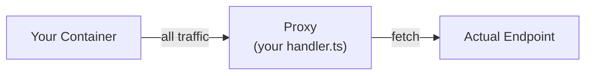

# wormhole

A transparent HTTP/HTTPS proxy sandbox for Docker. Drop it next to any container and intercept, inspect, or mutate every outbound request — no code changes required in your app.

Write a TypeScript handler file, mount it into the proxy, and every request your app makes passes through your `onRequest` / `onResponse` hooks before hitting the real upstream. All other outbound traffic is blocked.



## Quick Start

The fastest way to see it work — a `curl` container hits [httpbin.org/headers](https://httpbin.org/headers) through the proxy. The curl container has no proxy logic, SDK, or custom code. It just makes a normal HTTPS request.

```bash
docker compose -f examples/curl/docker-compose.yml up --build
```

httpbin echoes back the request headers. You'll see the `X-Wormhole: intercepted` header that [`handler.ts`](./handler.ts) injected — proving the proxy mutated the request transparently.

Point it at any URL with `TARGET_URL`:

```bash
TARGET_URL="https://your-api.com/endpoint" \
docker compose -f examples/curl/docker-compose.yml up --build
```

### Edit the handler

Open `handler.ts` — changes are picked up automatically (hot-reload, no restart). Both hooks are optional.

**Inject auth into every request:**
```ts
export function onRequest(req: Request): Request {
  const headers = new Headers(req.headers);
  headers.set("authorization", "Bearer " + process.env.MY_TOKEN);
  return new Request(req, { headers });
}
```

**Block specific domains:**
```ts
export function onRequest(req: Request): Request | Response {
  if (new URL(req.url).hostname === "tracking.example.com") {
    return new Response("Blocked", { status: 403 });
  }
  return req;
}
```

**Rewrite URLs (e.g., route to a mock):**
```ts
export function onRequest(req: Request): Request {
  const url = new URL(req.url);
  if (url.hostname === "api.stripe.com") {
    url.hostname = "mock-stripe";
    url.port = "4000";
    return new Request(url, { method: req.method, headers: req.headers, body: req.body, duplex: "half" } as RequestInit);
  }
  return req;
}
```

**Modify response bodies:**
```ts
export async function onResponse(res: Response, req: Request): Promise<Response> {
  if (!req.url.includes("/api/config")) return res;
  const config = await res.json();
  config.featureFlag = true;
  return new Response(JSON.stringify(config), { status: res.status, headers: res.headers });
}
```

See [Handler API](#handler-api) for full details.

### Use with your own app

```yaml
services:
  proxy:
    build: .
    cap_add:
      - NET_ADMIN
    volumes:
      - ./handler.ts:/app/handler.ts:ro
      - ca-certs:/etc/mwh

  app:
    image: your-app-image
    network_mode: "service:proxy"
    depends_on:
      proxy:
        condition: service_healthy
    volumes:
      - ca-certs:/etc/mwh:ro
    # Installs the CA into the system trust store, then runs your command
    entrypoint: ["/etc/mwh/wormhole-ca-init.sh"]
    command: ["node", "app.js"]

volumes:
  ca-certs:
```

Write a `handler.ts` with `onRequest` / `onResponse` hooks (both optional), then `docker compose up --build`. The proxy starts first, generates the CA, and your app waits until it's healthy before starting. Every HTTP and HTTPS request your app makes flows through your handler. All other outbound TCP is blocked.

## How It Works

1. Your app container shares the proxy's network namespace (`network_mode: "service:proxy"`)
2. An iptables rule redirects outbound TCP traffic to port `:3129`, while letting DNS through and exempting traffic from UID 1337 (the proxy itself)
3. A TCP multiplexer peeks at the first byte of each connection: `0x16` (TLS) routes to the HTTPS server, anything else routes to the HTTP server
4. For HTTPS, the proxy terminates TLS with a dynamically generated certificate for each domain, signed by a local CA
5. Your `handler.ts` hooks inspect and mutate the request before it's forwarded upstream
6. The proxy fetches the real upstream, passes the response through your `onResponse` hook
7. Your app gets back a response as if it talked to the upstream directly
8. All non-HTTP/HTTPS outbound traffic is blocked (sandbox mode)

## Handler API

### `onRequest(req) → Request | Response`

Called before the request is forwarded upstream. Return a `Request` to continue proxying, or return a `Response` to short-circuit the request entirely.

```ts
type OnRequest = (req: Request) =>
  | Request
  | Response
  | Promise<Request | Response>;
```

The request URL includes the scheme — `http://` for HTTP requests, `https://` for HTTPS. If you rewrite the URL, wormhole automatically updates the outbound `Host` header to match the new target.

### `onResponse(res, req) → Response`

Called after receiving the upstream response, before returning it to your app.

```ts
type OnResponse = (res: Response, req: Request) =>
  | Response
  | Promise<Response>;
```

Both hooks can be `async`.

### Body Semantics

`Request` and `Response` bodies are standard Fetch streams. If your handler calls `req.text()`, `req.json()`, `res.text()`, `res.json()`, or otherwise consumes the body, return a new `Request` or `Response` with the replacement body.

For example, to modify a JSON response:

```ts
export async function onResponse(res: Response, req: Request): Promise<Response> {
  if (!req.url.includes("/api/config")) return res;

  const config = await res.json();
  config.featureFlag = true;

  const headers = new Headers(res.headers);
  headers.delete("content-length");

  return new Response(JSON.stringify(config), {
    status: res.status,
    headers,
  });
}
```

### Hot Reload

Changes to `handler.ts` are picked up automatically. Edit, save, and the next request uses the updated handler. No restart needed.

### Error Handling

If your handler throws, the proxy logs the error and falls back to passthrough behavior — the request/response proceeds unmodified. This means a buggy handler won't break your app's traffic.


## CA Trust

The proxy generates a CA certificate at `/etc/mwh/ca.crt` on first startup. Your app container must trust this CA for HTTPS interception to work.

### Option A: System trust store (recommended)

Use the bundled init script as your app's entrypoint. It copies the CA into the system trust store and runs `update-ca-certificates` before starting your app:

```yaml
app:
  entrypoint: ["/etc/mwh/wormhole-ca-init.sh"]
  command: ["node", "app.js"]  # your original entrypoint
```

This works for most runtimes on Alpine and Debian-based images.

### Option B: Environment variables

If you can't change the entrypoint, or your runtime ignores the system store, set the appropriate env var:

| Runtime | Environment Variable |
|---------|---------------------|
| **Node.js** | `NODE_EXTRA_CA_CERTS=/etc/mwh/ca.crt` |
| **Python (requests/httpx)** | `REQUESTS_CA_BUNDLE=/etc/mwh/ca.crt` |
| **Python (stdlib/aiohttp)** | `SSL_CERT_FILE=/etc/mwh/ca.crt` |
| **Go** | `SSL_CERT_FILE=/etc/mwh/ca.crt` |
| **Ruby** | `SSL_CERT_FILE=/etc/mwh/ca.crt` |
| **Java** | See below |

**Java** requires importing into the JVM trust store:
```bash
keytool -importcert -noprompt -trustcacerts \
  -alias mwh-ca \
  -file /etc/mwh/ca.crt \
  -keystore $JAVA_HOME/lib/security/cacerts \
  -storepass changeit
```

> **Note:** Python's `certifi` package bundles its own CA store and ignores system certs. You must set `REQUESTS_CA_BUNDLE` explicitly when using `requests`, `httpx`, or similar libraries.

## Configuration

| Environment Variable | Default | Description |
|---------------------|---------|-------------|
| `MWH_PORT` | `3129` | Port the multiplexer listens on |
| `MWH_CA_DIR` | `/etc/mwh` | Directory for CA cert and key |
| `MWH_HANDLER_PATH` | `handler.ts` | Path to the handler file |
| `MWH_UPSTREAM_TIMEOUT` | `30000` | Upstream request timeout in ms |

## Testing

```bash
# Unit tests (no Docker required — includes proxy, certs, handler, SNI)
npm test

# Full Docker integration test (iptables + proxy → httpbin.org)
npm run test:docker
```

## Limitations

- **HTTP/1.1 only** — the proxy negotiates HTTP/1.1 via ALPN. HTTP/2 connections from your app will be downgraded.
- **Bodies are streaming** — the proxy forwards request and response bodies as streams. If your handler reads a body, you must return a new `Request` or `Response`, and large payload buffering becomes your handler's responsibility.
- **Single-host only** — the proxy intercepts traffic via iptables within a shared network namespace. It doesn't work across hosts.
- **Non-HTTP protocols blocked** — TCP connections using protocols other than HTTP/HTTPS (WebSocket upgrade, gRPC, raw TCP) will fail at the HTTP parsing layer. This is by design for sandboxing.
- **iptables-legacy** — some host kernels only support nftables. If iptables fails, try installing `iptables-legacy` in the Dockerfile.

## License

MIT
