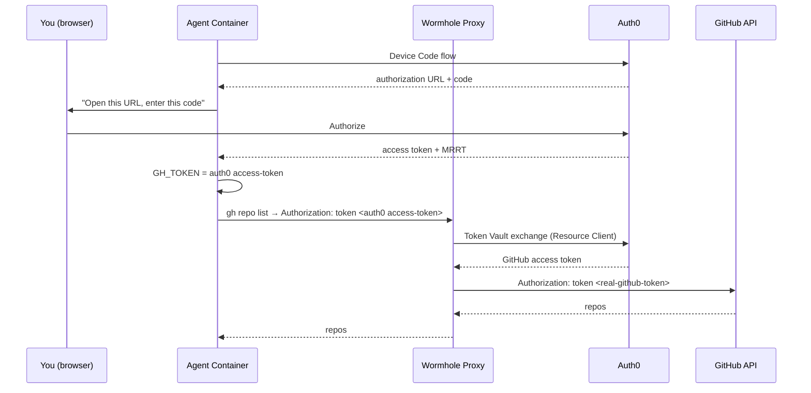

# GitHub CLI agent with Auth0 Token Vault

Untrusted code from an agent runs inside a container and uses the unmodified `gh` CLI. This container or the `gh` cli never grant access to the user's raw GitHub credential. 

Instead, the user's tokens are securely stored in [Auth0 Token Vault](https://auth0.com/docs/secure/call-apis-on-users-behalf/token-vault/configure-token-vault). The `gh` CLI makes calls using an Auth0 issued access token, and the actual GitHub token is inserted on the fly by the proxy.




## So what

The container's credential is an Auth0 access token — **not** a GitHub Token. This token is:

- **Audience-scoped** — only valid for the proxy, useless with GitHub directly.
- **Transparently exchanged** — the proxy swaps it for a real GitHub token via Token Vault; `gh` CLI runs completely unmodified

Optionally, set `ENABLE_DPOP=true` to add **DPoP proof-of-possession** binding (requires a paid Auth0 plan). With DPoP, the token is tied to an ephemeral or non-extractable key pair. In which case, even if the token leaks, it's worthless without the private key. 

We can further extend this concept to let agents run and execute code, which does not need access to sensitive credentials.

## Setup

You can run this entire flow as easily as `docker compose up` but you need some pre-requisites. Most of the setup is taken care of for you.

### Prerequisites

- Docker
- [Terraform](https://developer.hashicorp.com/terraform/install)
- An [Auth0 tenant](https://auth0.com/signup)
- A [GitHub OAuth App](https://github.com/settings/developers)

### 1. Create the GitHub OAuth App

Go to [GitHub Developer Settings](https://github.com/settings/developers) → OAuth Apps → New OAuth App:

| Field | Value |
|---|---|
| Homepage URL | `https://yourdomain.example.com/` |
| Callback URL | `https://YOUR-TENANT.us.auth0.com/login/callback` |

Save the **Client ID** and generate a **Client Secret**.

### 2. Enable My Account API

If not already enabled, go to **Auth0 Dashboard → Settings → Advanced → My Account API** and turn it on. The agent and connect app use it to check and manage connected accounts.

### 3. Provision Auth0 resources

```bash
cd terraform
cp terraform.tfvars.example terraform.tfvars
# Fill in your Auth0 domain, M2M credentials, and GitHub OAuth app credentials
terraform init
terraform apply
```

This will create and configure everything in Auth0, the API, Resource Client, Agent App, Connect App, GitHub connection (with Token Vault + Connected Accounts enabled), client grants, and MRRT policies. It writes a `.env` file with all the credentials.

### 4. Run

```bash
cd ..  # back to examples/gh-token-vault
docker compose up --build
```

### 5. Authorize the agent

The agent prints an authorization URL. Open it and log in:

```
============================================================
  Authorize this agent:

  https://your-tenant.us.auth0.com/activate?user_code=FXRL-MRGD
  Code: FXRL-MRGD
============================================================
```

### 6. Connect GitHub (One Time)

If GitHub isn't linked yet, the agent waits and points you to the companion app:

```
============================================================
  GitHub not connected. Open the companion app:

  http://localhost:3001
============================================================
```

Open `http://localhost:3001`, log in, click **Connect GitHub Account**, and authorize on GitHub. The agent detects the connection and continues:

### 7. Code Executes in the container

```
GitHub connected!

--- repos ---
you/repo-one                  description   public
you/repo-two                  description   public

--- starred ---
torvalds/linux
golang/go
```

## How it works

### Agent (`agent/agent.ts`)

1. Uses [`openid-client`](https://github.com/panva/openid-client) for OAuth **Device Code flow** → gets an Auth0 access token + MRRT
2. Exchanges MRRT for a **My Account API token** → checks if GitHub is connected
3. If not connected, waits for the user to link GitHub via the companion app
4. For each `gh` command, sets `GH_TOKEN` to the Auth0 token (optionally with a DPoP proof)
5. Spawns `gh` — which sends the token as `Authorization: token <packed>`

### Proxy handler (`handler.ts`)

1. Intercepts requests to `api.github.com`
2. Extracts the Auth0 token (and validates DPoP proof if enabled)
3. **Token Vault exchange**: sends the Auth0 token as `subject_token` to Auth0's `/oauth/token` using the Resource Client credentials via [`openid-client`](https://github.com/panva/openid-client)
4. Replaces `Authorization` with the real GitHub token
5. Forwards to GitHub

### Connect app (`connect/connect.ts`)

Companion web app using [`@auth0/auth0-hono`](https://github.com/auth0-lab/auth0-hono). Lets a user log in, link their GitHub account via the Connected Accounts API, and disconnect it.
