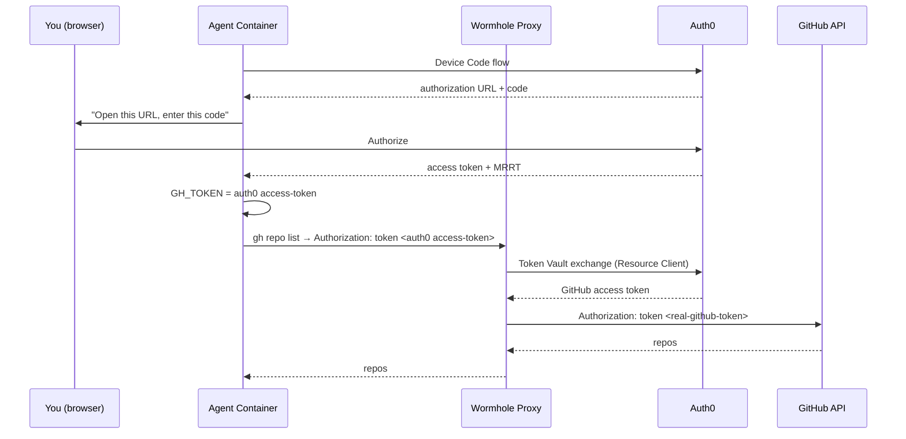

# GitHub CLI agent with Auth0 Token Vault

An agent runs `gh repo list` and other GitHub CLI commands — without ever having GitHub credentials. We transparently inject user-bound GitHub tokens via [Auth0 Token Vault](https://auth0.com/docs/secure/call-apis-on-users-behalf/token-vault/configure-token-vault).



## What makes this interesting

The agent's credential is an Auth0 access token — **not** a GitHub PAT. It's:

- **Audience-scoped** — only valid for the proxy API, useless with GitHub directly
- **Transparently exchanged** — the proxy swaps it for a real GitHub token via Token Vault; `gh` CLI runs completely unmodified

Optionally, set `ENABLE_DPOP=true` to add **DPoP proof-of-possession** binding (requires a paid Auth0 plan). With DPoP, the token is tied to an ephemeral key pair in the agent's process memory — even if the token leaks, it's worthless without the private key.

## Auth0 architecture

| Resource | Purpose |
|---|---|
| **API** (Resource Server) | Represents the proxy. Audience: `https://wormhole-proxy` |
| **Resource Client** | Linked to the proxy API via `resource_server_identifier`. Calls Token Vault with its own `client_id`/`client_secret` |
| **Agent App** (Native) | What the agent authenticates with. Device Code grant + MRRT |
| **Connect App** (Regular Web) | Companion app for linking GitHub via Connected Accounts |
| **GitHub Connection** | Social connection with Token Vault + Connected Accounts enabled |

The Resource Client is the key relationship — it's what authorizes the proxy to exchange tokens for this specific API audience.

## Setup

### Prerequisites

- Docker
- [Terraform](https://developer.hashicorp.com/terraform/install)
- An [Auth0 tenant](https://auth0.com/signup)
- A [GitHub OAuth App](https://github.com/settings/developers)

### 1. Create the GitHub OAuth App

Go to [GitHub Developer Settings](https://github.com/settings/developers) → OAuth Apps → New OAuth App:

| Field | Value |
|---|---|
| Homepage URL | `https://YOUR-TENANT.us.auth0.com` |
| Callback URL | `https://YOUR-TENANT.us.auth0.com/login/callback` |

Save the **Client ID** and generate a **Client Secret**.

### 2. Enable My Account API

If not already enabled, go to **Auth0 Dashboard → Settings → Advanced → My Account API** and turn it on. The agent and connect app use it to check and manage connected accounts.

### 3. Provision Auth0 resources

```bash
cd terraform
cp terraform.tfvars.example terraform.tfvars
# Fill in your Auth0 domain, M2M credentials, and GitHub OAuth app credentials
terraform init
terraform apply
```

This creates the API, Resource Client, Agent App, Connect App, GitHub connection (with Token Vault + Connected Accounts enabled), client grants, and MRRT policies. It writes a `.env` file with all the credentials.

### 4. Run

```bash
cd ..  # back to examples/gh-token-vault
docker compose up --build
```

### 5. Authorize the agent

The agent prints an authorization URL. Open it and log in:

```
============================================================
  Authorize this agent:

  https://your-tenant.us.auth0.com/activate?user_code=FXRL-MRGD
  Code: FXRL-MRGD
============================================================
```

### 6. Connect GitHub

If GitHub isn't linked yet, the agent waits and points you to the companion app:

```
============================================================
  GitHub not connected. Open the companion app:

  http://localhost:3001
============================================================
```

Open `http://localhost:3001`, log in, click **Connect GitHub Account**, and authorize on GitHub. The agent detects the connection and continues:

```
GitHub connected!

--- repos ---
you/repo-one                  description   public
you/repo-two                  description   public

--- starred ---
torvalds/linux
golang/go
```

## How it works

### Agent (`agent/agent.ts`)

1. Uses [`openid-client`](https://github.com/panva/openid-client) for OAuth **Device Code flow** → gets an Auth0 access token + MRRT
2. Exchanges MRRT for a **My Account API token** → checks if GitHub is connected
3. If not connected, waits for the user to link GitHub via the companion app
4. For each `gh` command, sets `GH_TOKEN` to the Auth0 token (optionally with a DPoP proof)
5. Spawns `gh` — which sends the token as `Authorization: token <packed>`

### Proxy handler (`handler.ts`)

1. Intercepts requests to `api.github.com`
2. Extracts the Auth0 token (and validates DPoP proof if enabled)
3. **Token Vault exchange**: sends the Auth0 token as `subject_token` to Auth0's `/oauth/token` using the Resource Client credentials via [`openid-client`](https://github.com/panva/openid-client)
4. Replaces `Authorization` with the real GitHub token
5. Forwards to GitHub

### Connect app (`connect/connect.ts`)

Companion web app using [`@auth0/auth0-hono`](https://github.com/auth0-lab/auth0-hono). Lets a user log in, link their GitHub account via the Connected Accounts API, and disconnect it.

### Security layers

| Layer | What it does |
|---|---|
| **iptables sandbox** | All agent traffic forced through wormhole — no direct internet access |
| **Audience scoping** | Auth0 token is only valid for the proxy API — useless with GitHub directly |
| **Resource Client isolation** | Only the proxy's Resource Client can call Token Vault for this API audience |
| **Token Vault** | Real GitHub credentials never enter the agent container |
| **MRRT** | Single refresh token for multiple APIs — agent checks connection status via My Account API |
| **DPoP** (optional) | Token bound to agent's ephemeral key — can't be replayed without the private key |

## Files

```
.
├── agent/
│   ├── Dockerfile         # Node 24 + gh CLI
│   ├── package.json       # dpop, openid-client
│   └── agent.ts           # Device code flow + MRRT + connected accounts → spawn gh
├── connect/
│   ├── Dockerfile         # Node 24
│   ├── package.json       # @auth0/auth0-hono, hono
│   └── connect.ts         # Connected Accounts companion app
├── terraform/
│   ├── main.tf            # API, Resource Client, Agent App, Connect App, GitHub connection, MRRT
│   ├── variables.tf
│   ├── outputs.tf
│   └── terraform.tfvars.example
├── handler.ts             # Token Vault exchange (+ optional DPoP validation)
├── Dockerfile.proxy       # Wormhole base + jose, openid-client
├── docker-compose.yml
├── .env.example
└── README.md
```
